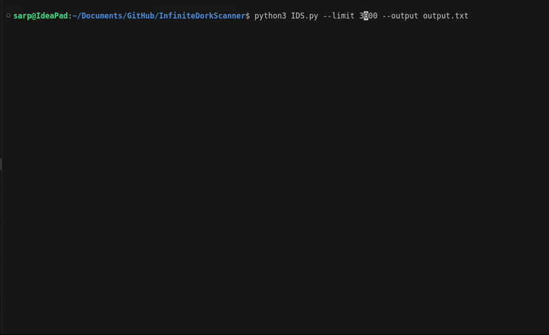

# Infinite Dork Scanner - Best OSINT Tool

## What is Infinite Dork Scanner?

IDS is a premium OSINT tool that allows you to scan dorks on Search Engines **WITHOUT LIMITS**. Forget about IP blocking, rate limiting and other restrictions. IDS is the best OSINT tool for scanning dorks and finding interesting URLs!

**IDS guarantees to retrieve URLs that have parameters that are possibly vulnerable to:**

- SQL Injection
- XSS
- LFI
- RFI
- SSRF

## Features

- **Infinite Scanning**
- No limits
- No IP Blocking
- No Rate Limiting

## Project Status

We need some time to finish the tool. We are working hard to make it the best OSINT tool on the market.

For now, you can use our free version of the tool. It has some limitations but it's still a great tool!

In the data folder, we have **500000** pre-scanned URLs that you can use for free. The demo IDS reads the data and outputs the URLs to a file.

## Installation

To install IDS, you can use the following command:

```bash
pip install -r requirements.txt
```

## Usage

To use our demo, you can just clone the repository and run the following command:

```bash
python3 IDS.py --limit 100 --output urls.txt
```

## Demo



## Disclaimer

This tool is for educational purposes only. We are not responsible for any damage caused by the tool. Use it at your own risk.